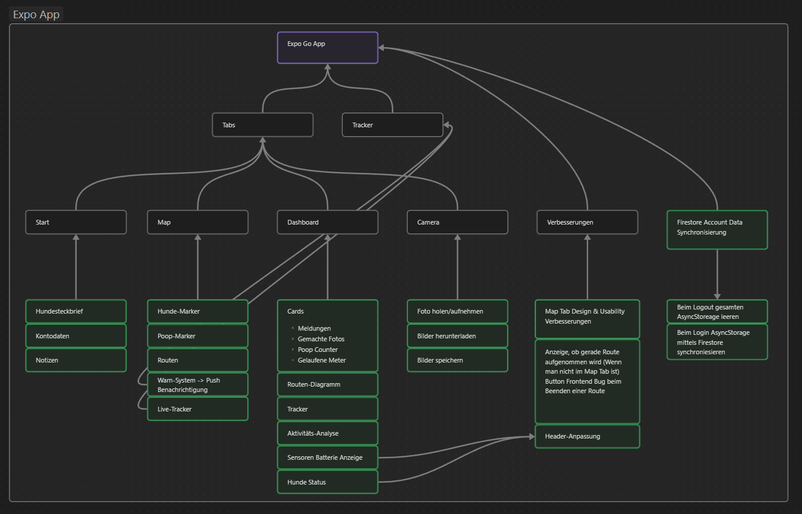

# DAPI Expo App

##### von Emilia Kötterl und Anton Rauchenberger

-   **Framework:** React Native mit Expo Go
-   **Plattform:** iOS
-   **Hauptfunktionen:** GPS-Tracking, Steckbriefverwaltung, Fotomodus, Kartenanzeige, Statistiken
-   **Konzept:**

    

    Das gesamte Frontend wurde mit klassischen React-Native Code geschrieben, wobei sich individuelle React-Komponenten in dem components-Verzeichnis befinden.
    Im providers-Verzeichnis wurden diverse Daten-Providers definiert, welche es ermöglichen, dass diese Daten in der gesamten App verfügbar sind. In den `_layout.tsx` Dateien wird jeweils die Struktur der aktuellen Route definiert.
    Mithilfe von statischen TypeScript-Klassen im lib-Verzeichnis wurde die Verbindung zur Firebase-Datenbank (Firestore) hergestellt. In diesen Klassen wurden auch mittels `fetch(https...)` auf die API des Servers zugegriffen und lokale Berechnungen und Formatierungen durchgeführt.
